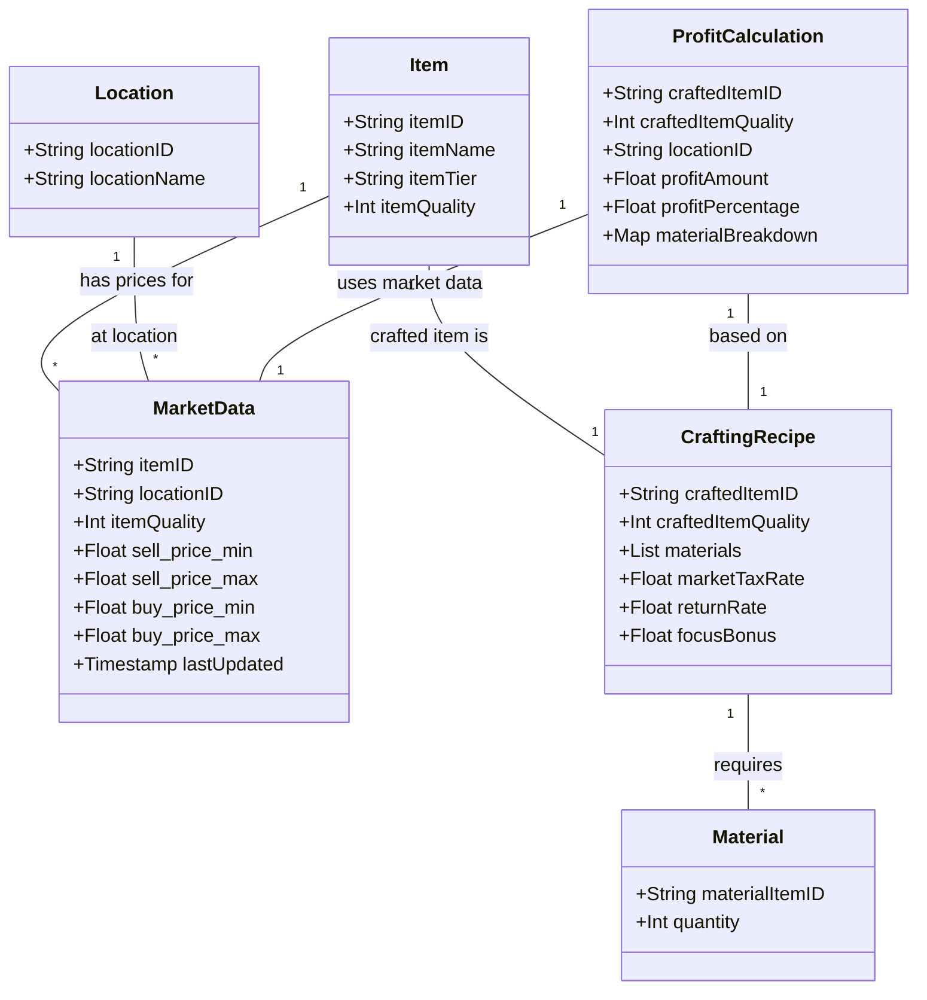

Here's the detailed breakdown of the Data Structure, Logic Flow, and Architecture for KoryenAlbCraft, drawing on the provided sources and the understanding of Phillip Choi's approach.

---

# KoryenAlbCraft: Data Structure, Logic Flow, and Architecture

This document outlines the foundational elements of KoryenAlbCraft, a web application designed to optimize crafting and market trading in _Albion Online_. The design principles are heavily influenced by Component-Based Architecture (CBA) and Phillip Choi's philosophy of building real, problem-solving projects through iterative development.

## 1. Data Structure

The core of KoryenAlbCraft's functionality relies on processing and presenting market and crafting data from _Albion Online_. The data structure, while not explicitly presented as a diagram in the sources, can be inferred from the detailed problem analysis and solution description.

### Markdown Document: KoryenAlbCraft Data Structure

The primary data entities and their key attributes for KoryenAlbCraft are as follows:

-   **Item**: Represents any item in _Albion Online_.

    -   `itemID`: Unique code used by the Albion Online Data Project API (e.g., "T4_BAG_LEATHER").
    -   `itemName`: User-friendly name (e.g., "Buttler Leather", "Steel Bar").
    -   `itemTier`: The tier of the item (e.g., T4, T8).
    -   `itemQuality`: Quality level of the item (e.g., Normal, Good, Outstanding, Excellent), mapped to numerical IDs (e.g., 1, 2, 3, 4, 5).

-   **Location (City)**: Represents a market city in _Albion Online_.

    -   `locationID`: Code for the city (e.g., "Thetford", "Fort Sterling", "Caerleon", "Martlock", "Lymhurst", "Bridgewatch").
    -   `locationName`: User-friendly city name.

-   **MarketData**: Real-time market prices fetched from the Albion Online Data Project API.

    -   `itemID`: Foreign key referencing `Item`.
    -   `locationID`: Foreign key referencing `Location`.
    -   `itemQuality`: Foreign key referencing `Item`.
    -   `sell_price_min`: Lowest sell order price.
    -   `sell_price_max`: Highest sell order price.
    -   `buy_price_min`: Lowest buy order price.
    -   `buy_price_max`: Highest buy order price.
    -   `lastUpdated`: Timestamp of the last price update.

-   **CraftingRecipe**: Defines the materials and conditions for crafting an item.

    -   `craftedItemID`: Foreign key referencing `Item` (the item being crafted).
    -   `craftedItemQuality`: Foreign key referencing `Item` (quality of the crafted item).
    -   `materials`: An array of objects, each specifying:
        -   `materialItemID`: Foreign key referencing `Item`.
        -   `quantity`: Amount of material required.
    -   `marketTaxRate`: The percentage market tax (e.g., **6.5%**).
    -   `returnRate`: Percentage of materials returned during crafting, which can vary by city and focus.
    -   `focusBonus`: Additional return rate if crafting with focus.

-   **ProfitCalculation**: The result of the profit analysis.
    -   `craftedItemID`: Foreign key referencing `Item`.
    -   `craftedItemQuality`: Foreign key referencing `Item`.
    -   `locationID`: Foreign key referencing `Location`.
    -   `profitAmount`: The calculated profit in silver.
    -   `profitPercentage`: The calculated profit as a percentage.
    -   `materialBreakdown`: Details of material costs for transparency.

### Mermaid Graph: KoryenAlbCraft Data Structure (Conceptual)



## 2. Logic Flow

The initial MVP (Version 0.1) of KoryenAlbCraft focuses on a streamlined user experience to quickly address the most critical pain point: manual profit calculation for a single item.

### Markdown Document: KoryenAlbCraft v0.1 Logic Flow

The user journey for KoryenAlbCraft v0.1 follows a clear, sequential path:

1.  **Visits Landing Page**: The user first accesses the KoryenAlbCraft web application [A in graph, 81].
2.  **Clicks Login with Google**: If they are not already authenticated, the user initiates the login process via Google OAuth [B in graph, 81]. This authentication step aligns with the potential for the tool to be exclusive to "our community" as mentioned in the source.
3.  **Approves Google Permissions**: The user grants the necessary permissions for the application through Google's consent screen [C in graph, 81].
4.  **Lands on Main App Interface**: Upon successful authentication, the user is directed to the core application interface [D in graph, 81].
5.  **Selects Crafting Item, Quality, and Location**: On the main interface, the user inputs or selects a specific crafting item (e.g., "Buttler Leather"), its desired quality, and a particular city/location within _Albion Online_. This interaction happens through a `CraftingInputForm.tsx` component [E in graph, 34, 38, 45, 49].
6.  **Clicks "Calculate Profit" Button**: The user then triggers the profit calculation by clicking a dedicated button [F in graph, 34, 45].
7.  **System: Fetches Market Data**: In the backend, the `albion-data.ts` service module communicates with the **Albion Online Data Project API** to automatically retrieve the latest market prices for both the selected crafted item and its required raw materials. This module is crucial for handling consolidated requests to **circumvent API rate limits** (180 requests/minute) [G in graph, 37, 38, 40, 48, 49, 51, 90].
8.  **System: Calculates Profit**: The backend's `/api/crafting-profit/route.ts` endpoint performs the actual profit calculation. This involves subtracting the total material costs (based on fetched market prices) from the selling price of the crafted item, accounting for the **6.5% market tax** and predefined return rates [H in graph, 34, 37, 38, 40, 45, 48, 49, 51].
9.  **User Views Instant Profit Display**: Finally, the calculated profit is instantly displayed on the frontend, often in a clear tabular format via the `ProfitDisplay.tsx` component [I in graph, 34, 38, 45, 49]. This allows the user to quickly assess the profitability of crafting that specific item.

This phased approach embodies **Phillip Choi's "build while learning" principle** by starting with a core, solvable problem (MVP) and then iteratively adding complexity and features in subsequent phases.

### Mermaid Graph: KoryenAlbCraft v0.1 UX Flow

```mermaid
graph TD
    subgraph "Phase 1: Onboarding"
        A[Visits Landing Page] --> B{Clicks Login with Google};
        B --> C[Approves Google Permissions];
        C --> D[Lands on Main App Interface];
    end

    subgraph "Phase 2: MVP Core Functionality"
        D --> E[Selects Crafting Item, Quality & Location];
        E --> F[Clicks "Calculate Profit" Button];
        F -- Frontend Request --> G[Backend: Fetches Market Data from Albion Online Data Project API];
        G --> H[Backend: Calculates Profit];
        H -- JSON Response --> I[Views Instant Profit Display];
    end
```

## 3. Architecture

KoryenAlbCraft will be built using a **Component-Based Architecture (CBA)**, specifically following a **Hybrid "Domain-Driven + UI Primitives"** approach. This architectural choice is explicitly stated in the project plan, drawing inspiration from `_architecture.md` and aligning with Phillip Choi's emphasis on building maintainable and scalable projects.

### Markdown Document: KoryenAlbCraft Architecture

**Core Principles of the Architecture:**

-   **Component-Based Architecture (CBA)**: The application is fundamentally broken down into smaller, self-contained "pieces" or components. Each component is designed with a **single responsibility**, making the codebase easier to read, manage, and extend.
-   **Atomic Design**: Components are organized hierarchically, moving from the most basic elements to more complex structures:
    -   **UI Primitives (Atoms)**: Foundational, reusable UI elements like `Button`, `Input`, `Select`, and `Table`. They are stateless and style-agnostic.
    -   **Feature Modules (Molecules/Organisms)**: Components grouped by their specific application feature or "domain". These often manage state and user interactions. For KoryenAlbCraft, examples include `CraftingInputForm.tsx` and `ProfitDisplay.tsx`.
    -   **Layout Components (Templates)**: Define the overall structure and common elements of pages, like headers and footers.
    -   **Page Containers (Pages)**: The top-level components that compose the UI Primitives and Feature Modules to form complete pages. In Next.js, these are typically `page.tsx` files.
-   **Feature-First (Domain-Driven) Folder Structure**: The codebase is organized by features or domains (e.g., `crafting-profit`, `authentication`). This means all related components, hooks, and logic for a specific feature reside within its dedicated folder, promoting **high cohesion**.
-   **Reusability & Maintainability**: CBA enables components to be reused across different parts of the application, and improvements to one component can be made without affecting other parts of the system, leading to easier maintenance.
-   **Loose Coupling / High Cohesion**: Components interact through well-defined interfaces (props, events, API calls) while encapsulating their internal logic. This reduces dependencies and makes the system more robust.
-   **Testability**: The modular nature of CBA makes it straightforward to test individual components in isolation (unit tests).

**Proposed Project Structure (Next.js with App Router):**

-   `/app`
    -   `/api`
        -   `/crafting-profit`
            -   `route.ts`: **Secure backend endpoint** for orchestrating the core crafting profit calculation logic, receiving user input, calling services, and returning results. This is where the main business logic resides.
    -   `page.tsx`: **Home Page Container**. A Server Component that conditionally renders `LoginButton` for guests or `UserNav` and `NoteCaptureInterface` (or equivalent for KoryenAlbCraft) for authenticated users.
-   `/components`
    -   `/ui`: **UI Primitives (Atoms)**. Basic building blocks, installed via shadcn/ui.
        -   `Button.tsx`
        -   `Input.tsx`
        -   `Select.tsx`
        -   `Table.tsx`
        -   `index.ts` (for re-exports)
    -   `/features`: **Feature Modules (Molecules & Organisms)**. Grouped by domain.
        -   `/authentication` (or `auth`):
            -   `LoginButton.tsx` (Client Component for Google OAuth)
            -   `UserNav.tsx` (Client Component to display user and logout)
        -   `/crafting-profit`:
            -   `CraftingInputForm.tsx`: **Client Component** encapsulating user inputs for item selection, quality, and location.
            -   `ProfitDisplay.tsx`: **Client Component** for rendering calculated profit and market data.
            -   `LocationSelector.tsx` (potential component for city selection)
            -   `RecipeManagement.tsx` (for Version 1.0)
-   `/services`: **Server-side only modules** for abstracting external API communication.
    -   `albion-data.ts`: **Critical module** for all communication with the Albion Online Data Project API. It handles **consolidated requests** to bypass rate limits, parses JSON data, and manages item ID mapping.
    -   (Potentially other service modules for different APIs or data sources in future versions).
-   `/types`: **Type definitions** for TypeScript.
-   `/lib`: For reusable **business logic** that is not tied to a specific UI component or external service.
-   `/hooks`: For reusable **logic with state**.
-   `/styles`: Global styles and theming (e.g., Tailwind CSS configuration, `theme.ts`, `globals.css`).
-   `/utils`: General helper functions.

**Alignment with Phillip Choi's Philosophy:**

This architectural approach directly supports Phillip Choi's advice for breaking into tech:

-   **"Build one real project that showcases problem-solving skills, not just coding ability"**: KoryenAlbCraft is a direct response to a "genuine problem" in _Albion Online_ crafting, automating a previously "time-consuming" and "manual effort" process. This project will develop "problem-solving muscles" by making real decisions about data handling, API limitations, and user experience.
-   **"Build while learning"**: The phased development plan (MVP Version 0.1 first, then comprehensive Version 1.0) enables immediate implementation of learned concepts. The architecture, with its clear component separation, allows for incremental development and rapid iteration, which is a core tenet of Phillip Choi's strategy.
-   **Focus on User Experience (UX)**: The detailed UX mapping for Version 0.1 and the vision for Version 1.0 emphasize an "intuitive web interface" and "instant profit display", directly addressing the user's need for a "fast, automated, and accurate way" to gain insights. This focus on a good UX makes the project valuable and demonstrates practical application of skills.
-   **Scalability and Maintainability**: The CBA and feature-first structure are chosen precisely because they make the project "easy to manage," "reusable," and "ready for long-term development". This prepares the project for future expansions (e.g., multi-city comparisons, market arbitrage) envisioned in Version 1.0.

By adhering to this robust and user-centric architecture, KoryenAlbCraft aims to provide significant value to _Albion Online_ players and serve as a strong portfolio project demonstrating advanced problem-solving and development skills.
